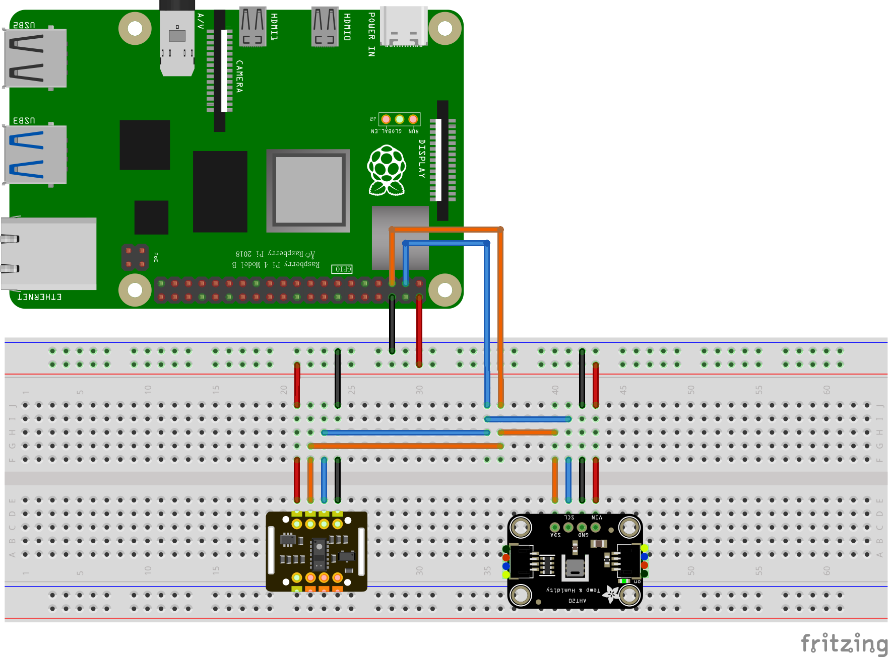

# 硬件构建手册

这个部分主要记录硬件的搭建过程，以及在搭建过程中可能遇到的问题和解决方法。

## 传感器

本项目的传感器如下表所示：

| 项目  | 传感器名称         | 型号    | 描述                         | 数量 (pcs)     | 规格书      |
|:----:|------------------|:--------:|-------------------------------|:---------:|:-----------:|
|  1   | 摄像头           | WebCam   | 采集面部图像和照片              | 1         |             |
|  2   | 脉搏传感器       | MAX30102 | 采集ECG心电图、脉搏、血氧数据    | 1         |             |
|  3   | 湿度、温度传感器 | AHT20    | 采集手指的湿度和温度变化         | 1         |             |

## 传感器与 Raspberry Pi 连接说明

  

该电路连接图通过 *Frizing* 绘制，你可以按上述说明连接电路，确保所有传感器通过正确的线路连接到 Raspberry Pi。如果有多个传感器，只需在 I2C 总线（SDA 和 SCL）扩展连接即可。*Frizing* 绘制的电路图文件已经上传到项目仓库中，你可以使用 Frizing 软件进行查看。

### Raspberry Pi
 - **GND**（地线）：黑色线连接到 Raspberry Pi 的 **GND** 引脚
 - **VIN**（电源输入）：红色线连接到 Raspberry Pi 的 **5V** 引脚或 **3.3V** 引脚，**注意**：具体取决于传感器的电压需求（通常 5V 或 3.3V）
 - **SDA**（数据线）：橙色线连接到 Raspberry Pi 的 **GPIO 2**（SDA）
 - **SCL**（时钟线）：蓝色线连接到 Raspberry Pi 的 **GPIO 3**（SCL）

### 传感器（多个 I2C 传感器）
 - 每个传感器的 **GND** 引脚连接到 Raspberry Pi 的 **GND** 引脚（黑色线）
 - 每个传感器的 **VIN** 引脚连接到 Raspberry Pi 的 **5V** 或 **3.3V** 引脚（红色线），确保电压一致
 - 每个传感器的 **SDA** 引脚连接到 **SDA** 总线上，即 Raspberry Pi 的 **GPIO 2**（橙色线）
 - 每个传感器的 **SCL** 引脚连接到 **SCL** 总线上，即 Raspberry Pi 的 **GPIO 3**（蓝色线）

### 注意事项：
1. **I2C 地址冲突**：如果连接多个 I2C 设备，请确保它们的地址不冲突。如果有冲突，可以通过设置传感器的地址（通过跳线或软件配置）来解决。
2. **电压匹配**：确保传感器的电源电压与 Raspberry Pi 提供的电压匹配，通常传感器支持 3.3V 或 5V，具体取决于传感器型号。
3. **I2C 引脚**：确保使用 Raspberry Pi 上的 **GPIO 2**（SDA）和 **GPIO 3**（SCL）作为数据传输线路。
