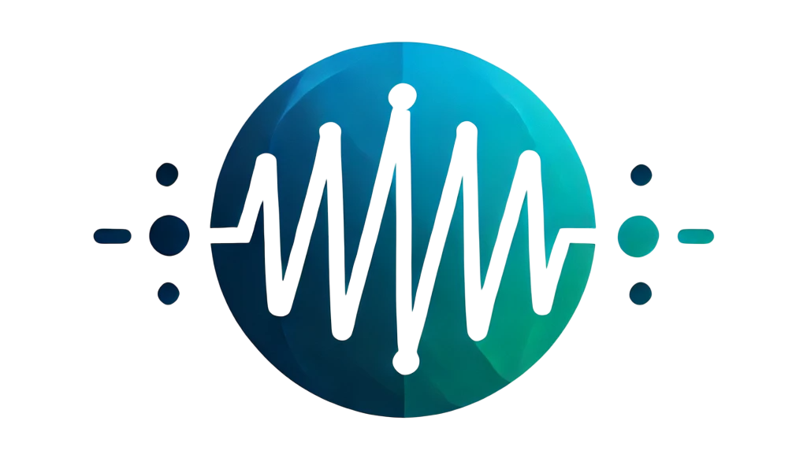

    
    

      <i align="center">An ECG-Assisted Emotion Monitoring System that captures facial expressions via a camera and extracts micro-expression features using image recognition. By integrating ECG signals, the system aims for precise emotion assessment, enhancing mental health monitoring and awareness.🫀</i>
    

    

     
     
     
     
     
     
    
 
        
       
       
        
        
    
[Hardware Installation](#installation) •
[Software Deployment](#examples) •
[Documentation](#documentation) •
[Contributors](#contributions)

# ECG Assisted Emotion Monitoring Introduction

Here is the Raspberry Pi cross-compilation instructions: ([English](https://github.com/Ww1247/ECG-Assisted-Emotion-Monitoring/wiki/ECG-Assisted-Emotion-Monitoring%E2%80%90en) | [中文](https://github.com/Ww1247/ECG-Assisted-Emotion-Monitoring/wiki/ECG-Assisted-Emotion-Monitoring%E2%80%90zh))

# Hardware Development Guidance

### Sensors Components
| Item | Component Name | Part Number | Description                                 | Quantity |  Notes              | Datasheet |
|:----:|:--------------:|:-----------:|:-------------------------------------------:|:--------:|:-------------------:|:---------:|
|  1   | Camera         |             | Video and still image capture               | 1 (pcs)  | Facial recognition  |           |

# Contributors

<!---
npx contributor-faces --exclude "*bot*" --limit 70 --repo "https://github.com/amplication/amplication"

change the height and width for each of the contributors from 80 to 50.
--->

[//]: contributor-faces

  

[//]: contributor-faces

| Name         | ID       | Role                                                                                                                              |
| ------------ |:--------:| --------------------------------------------------------------------------------------------------------------------------------- |
|              | 3007288W | Responsible for the QT part of the code, including GUI design and communication code creation.                                    |
|              |          |                                                                                                                                   |
|              |          |                                                                                                                                   |
|              |          |                                                                                                                                   |
|              |          |                                                                                                                                   |

# License
MIT License Copyright (c) 2025 Wx1247
